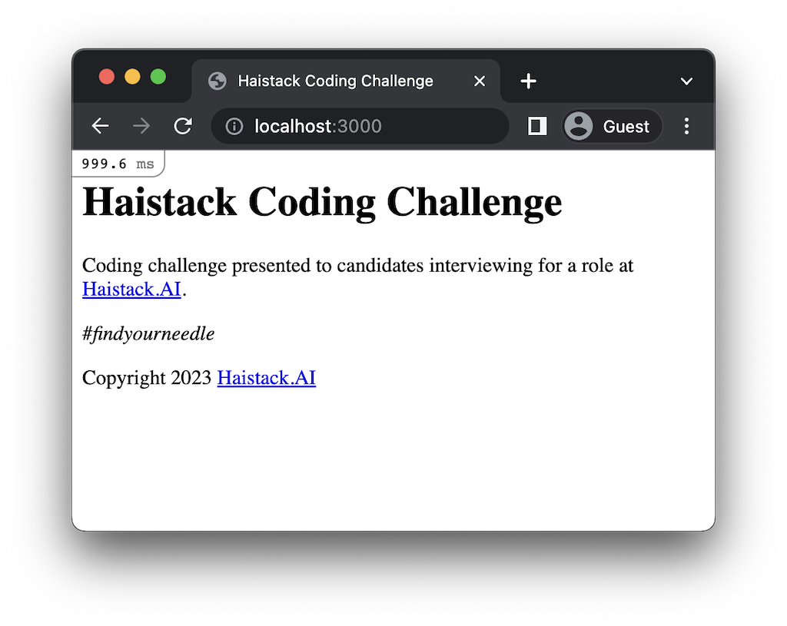

# Haistack Coding Challenge

Coding challenge presented to candidates interviewing for a role at [Haistack.AI](https://www.linkedin.com/company/haistack/).

_#findyourneedle_



## Installation

1. Install [Docker Desktop](https://docs.docker.com/get-docker/).
2. [Clone this repository](https://docs.github.com/en/repositories/creating-and-managing-repositories/cloning-a-repository).
3. Copy the example [environment file](https://docs.docker.com/compose/environment-variables/env-file/).   
4. [Build the container image](https://docs.docker.com/engine/reference/commandline/compose_build/).
5. [Install JavaScript dependencies](https://classic.yarnpkg.com/en/docs/cli/install).
6. [Create and start the containers](https://docs.docker.com/engine/reference/commandline/compose_up/).

```shell
git clone git@github.com:Lateral-Link/haistack-coding-challenge.git

cd haistack-coding-challenge

cp .env.example .env

docker compose build --no-cache

docker compose --rm app yarn install

docker compose up
```

## Usage

Browse to http://localhost:3000.

### Running tests

```shell
docker compose run -e RAILS_ENV=test --rm app bundle exec rspec
```

## Support

Contact the authors in case of problems.  

## Contributing

Follow [these instructions](https://docs.github.com/en/get-started/quickstart/contributing-to-projects).

## Authors and acknowledgment

- [Mike Heise](mailto:mheise@haistack.ai)
- [Will Rosa](mailto:wrosa@haistack.ai)

## License

Copyright 2023 [Haistack.AI](https://www.linkedin.com/company/haistack/)

# Issue 5

We'll be solving this issue:
Create the candidates section by following these rules:

A list of all candidates should include their name, email address, options to edit and delete each record, and an option to add a new record. ✔
A candidate must have a name, a unique email address, and a date of birth in the past. ✔
The frontend must be implemented using React. ✔
The backend must be implemented as a REST API.✔
The backend must implement tests using RSpec. ✔

## Back-end Progress
Created Models and Controllers with rails generate
Moved controller to api proper namespace (api/v1)
Added routes for api/v1/candidates
Added candidate controller endpoints (Basic CRUD index search show create update destroy)
Added candidate model validations (birth_date)
Adjusted migrations to use index on email (unique key)
Adjusted migrations to limit fields
Disabled csrf protection for api
Added tests for candidates controller
Added tests for candidates model
Rubocoped project

## Front-end Progress

Created app.js file
Linked components with react-router-dom
Created Components folder
Created CandidateList component
Created Styles folder
Created TableHeader component
Listed candidates in CandidateList component with axios
Styled CandidateList component with styled components
Created Create button in Candidates component
Created Candidate component
Created Action on Candidate component
Added delete functionality to Candidate component
Styled Candidate component
Created CandidateForm component
Created update possibility within CandidateForm component
Adjusted CandidateForm to be used for both create and update
Added ages and date of birth validations to CandidateForm component
Added unique email validation to CandidateForm component
Added function search bar to CandidateList component
Added filter/sort by name, email and date of birth to CandidateList component
Added pagination to CandidateList component

## Future Improvements

Add more tests to the front-end
Add more tests to the back-end
Add signin and signup functionality
Add authentication and authorization
Fix csrv without disabling it
Change style to be more appealing
Use another form of alert instead of alert(). It's not very user friendly (maybe toast could help)
Add DRY or some sort of Design Pattern to back-end (for now using MVC)
Add some sort of Design Pattern to front-end  (for now using Components)