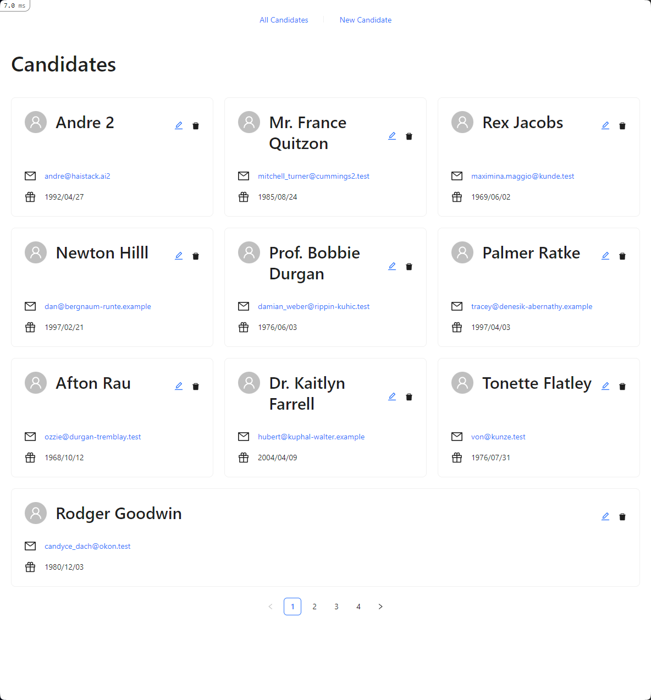

# Haistack Coding Challenge

Coding challenge presented to candidates interviewing for a role at [Haistack.AI](https://www.linkedin.com/company/haistack/).

_#findyourneedle_



## Resolution summary
All of the PRs can be found at https://github.com/andrecego/haistack-coding-challenge/pulls?q=is%3Apr+is%3Aclosed
API Documentation can be found at http://localhost:3000/api-docs

Key points of each PR:
- [PR #1](https://github.com/andrecego/haistack-coding-challenge/pull/1): Initial setup of the project with frontend aliases
- [PR #2](https://github.com/andrecego/haistack-coding-challenge/pull/2): Added lint and test workflows
- [PR #3](https://github.com/andrecego/haistack-coding-challenge/pull/3): Setup the frontend test environment with vitest and react-testing-library
- [PR #4](https://github.com/andrecego/haistack-coding-challenge/pull/4): Add the candidate model
- [PR #5](https://github.com/andrecego/haistack-coding-challenge/pull/5): Base validator and validator classes
- [PR #6](https://github.com/andrecego/haistack-coding-challenge/pull/6): Create use case to create a candidate along with the route
- [PR #7](https://github.com/andrecego/haistack-coding-challenge/pull/7): Add Swagger documentation
- [PR #8](https://github.com/andrecego/haistack-coding-challenge/pull/8): Add Paginate service and oj for performance
- [PR #9](https://github.com/andrecego/haistack-coding-challenge/pull/9): Show candidate endpoint
- [PR #10](https://github.com/andrecego/haistack-coding-challenge/pull/10): Update candidate endpoint
- [PR #11](https://github.com/andrecego/haistack-coding-challenge/pull/11): Delete candidate endpoint
- [PR #12](https://github.com/andrecego/haistack-coding-challenge/pull/12): Add ESLint and linting rules
- [PR #13](https://github.com/andrecego/haistack-coding-challenge/pull/13): Add i18n
- [PR #14](https://github.com/andrecego/haistack-coding-challenge/pull/14): Add Candidate card
- [PR #15](https://github.com/andrecego/haistack-coding-challenge/pull/15): Add Candidates list
- [PR #16](https://github.com/andrecego/haistack-coding-challenge/pull/16): Add Candidate Form and Candidate New pages
- [PR #17](https://github.com/andrecego/haistack-coding-challenge/pull/17): Refactor the candidate new to candidate upsert
- [PR #18](https://github.com/andrecego/haistack-coding-challenge/pull/18): Add delete candidate button
- [PR #19](https://github.com/andrecego/haistack-coding-challenge/pull/19): Documentation and final touches


## Installation

1. Install [Docker Desktop](https://docs.docker.com/get-docker/).
2. [Clone this repository](https://docs.github.com/en/repositories/creating-and-managing-repositories/cloning-a-repository).
3. Copy the example [environment file](https://docs.docker.com/compose/environment-variables/env-file/).   
4. [Build the container image](https://docs.docker.com/engine/reference/commandline/compose_build/).
5. [Install JavaScript dependencies](https://classic.yarnpkg.com/en/docs/cli/install).
6. [Create and start the containers](https://docs.docker.com/engine/reference/commandline/compose_up/).

```shell
git clone git@github.com:Lateral-Link/haistack-coding-challenge.git

cd haistack-coding-challenge

cp .env.example .env

docker compose build --no-cache

docker compose --rm app yarn install

docker compose up
```

## Usage

Browse to http://localhost:3000.

### Running tests

```shell
docker compose run -e RAILS_ENV=test --rm app bundle exec rspec
```

## Support

Contact the authors in case of problems.  

## Contributing

Follow [these instructions](https://docs.github.com/en/get-started/quickstart/contributing-to-projects).

## Authors and acknowledgment

- [Mike Heise](mailto:mheise@haistack.ai)
- [Will Rosa](mailto:wrosa@haistack.ai)

## License

Copyright 2023 [Haistack.AI](https://www.linkedin.com/company/haistack/)
