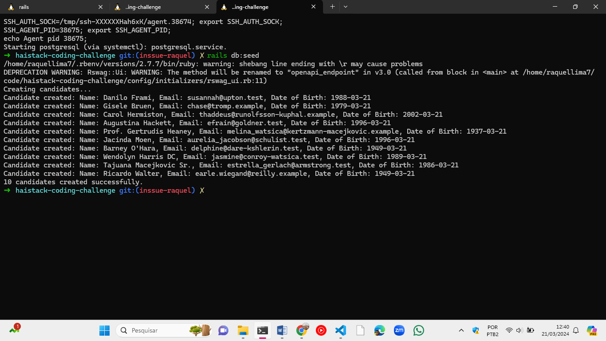

# API Candidates

This is a project for API Candidates, which manages a list of candidates with name, email, and date of birth. Each candidate must have a name, a unique email address, and a date of birth in the past.

To get started, 10 candidates have been added to the database for testing purposes. Run the following command to populate the database:

```shell
rails db:seed
```



To test the application, you can start the Rails server with the following command:

```shell
rails s
```

Or, if you prefer to use Docker:

```shell
docker-compose up
```

The project documentation is available at http://localhost:3000/api-docs/index.html, where you can test the endpoints.


## Listing Candidates
The GET /api/v1/candidates endpoint returns a list of all candidates. You can use the limit and offset parameters for pagination on the frontend.

These parameters allow you to control how many results are returned at a time and from which position in the list they start. This is useful for handling large datasets and improving application performance.


## Candidate Filtering
You can filter candidates by the date_of_birth, name, and email fields. For example, to find all candidates whose name starts with the letter "J", or whose email contains a certain domain, or by a specific date of birth.


## Candidate Creation
The POST /api/v1/candidates endpoint allows you to create a new candidate. Simply fill in the information in the request body and send it.


If you try to register a candidate with an email that already exists, or with a date of birth in the future, you will receive an appropriate error.


## Candidate Details
The GET /api/v1/candidates/:id endpoint provides details about a specific candidate.


## Candidate Editing
The PUT /api/v1/candidates/:id endpoint allows you to edit a specific candidate.


## Candidate Removal
The DELETE /api/v1/candidates/:id endpoint allows you to delete a specific candidate.


## RSpec
The project includes automated tests using RSpec. The simplecov gem has been added to the Gemfile to check the code coverage of the system. This check is important to ensure that all code is tested, thereby reducing the occurrence of future bugs.

To generate the test coverage report, run the RSpec command. The report will be generated in a file called index.html in the coverage folder.

You can access this file at path/to/coverage/index.html.


As seen in the report, 100% of the tests are present and functioning correctly.


____________________________________________________________________________________
# Haistack Coding Challenge

Coding challenge presented to candidates interviewing for a role at [Haistack.AI](https://www.linkedin.com/company/haistack/).

_#findyourneedle_


## Installation

1. Install [Docker Desktop](https://docs.docker.com/get-docker/).
2. [Clone this repository](https://docs.github.com/en/repositories/creating-and-managing-repositories/cloning-a-repository).
3. Copy the example [environment file](https://docs.docker.com/compose/environment-variables/env-file/).   
4. [Build the container image](https://docs.docker.com/engine/reference/commandline/compose_build/).
5. [Install JavaScript dependencies](https://classic.yarnpkg.com/en/docs/cli/install).
6. [Create and start the containers](https://docs.docker.com/engine/reference/commandline/compose_up/).

```shell
git clone git@github.com:Lateral-Link/haistack-coding-challenge.git

cd haistack-coding-challenge

cp .env.example .env

docker compose build --no-cache

docker compose --rm app yarn install

docker compose up
```

## Usage

Browse to http://localhost:3000.

### Running tests

```shell
docker compose run -e RAILS_ENV=test --rm app bundle exec rspec
```

## Support

Contact the authors in case of problems.  

## Contributing

Follow [these instructions](https://docs.github.com/en/get-started/quickstart/contributing-to-projects).

## Authors and acknowledgment

- [Mike Heise](mailto:mheise@haistack.ai)
- [Will Rosa](mailto:wrosa@haistack.ai)

## License

Copyright 2023 [Haistack.AI](https://www.linkedin.com/company/haistack/)
